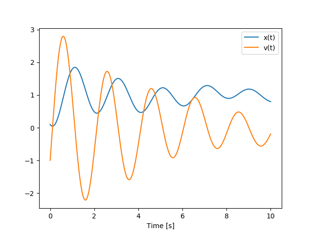

====
PyDy
====

|pypi| |anaconda| |rtd-docs| |travis-build| |appveyor| |gitter|

.. |pypi| image:: https://img.shields.io/pypi/v/pydy.svg
   :target: https://pypi.python.org/pypi/pydy
   :alt: Latest Released Version

.. |anaconda| image:: https://anaconda.org/conda-forge/pydy/badges/version.svg
   :target: https://anaconda.org/conda-forge/pydy

.. |rtd-docs| image:: https://readthedocs.org/projects/pydy/badge/?version=stable
   :target: https://pydy.readthedocs.io/en/stable/?badge=stable
   :alt: Documentation Status

.. |travis-build| image:: https://travis-ci.org/pydy/pydy.png?branch=master
   :target: https://travis-ci.org/pydy/pydy

.. |appveyor| image:: https://ci.appveyor.com/api/projects/status/orj87gyb0c1wqc6j/branch/master?svg=true
   :target: https://ci.appveyor.com/project/moorepants/pydy/branch/master

.. |gitter| image:: https://badges.gitter.im/Join%20Chat.svg
   :target: https://gitter.im/pydy/pydy?utm_source=badge&utm_medium=badge&utm_campaign=pr-badge&utm_content=badge

PyDy_, short for Python Dynamics, is a tool kit written in the Python
programming language that utilizes an array of scientific programs to enable
the study of multibody dynamics. The goal is to have a modular framework that
can provide the user with their desired workflow, including:

- Model specification
- Equation of motion generation
- Simulation
- Visualization
- Benchmarking
- Publication

.. _PyDy: http://pydy.org

We started by building the SymPy_ `mechanics package`_ which provides an API
for building models and generating the symbolic equations of motion for complex
multibody systems. More recently we developed two packages, `pydy.codegen` and
`pydy.viz`, for simulation and visualization of the models, respectively.  This
Python package contains these two packages and other tools for working with
mathematical models generated from SymPy mechanics. The remaining tools
currently used in the PyDy workflow are popular scientific Python packages such
as NumPy_, SciPy_, IPython_, Jupyter_, ipywidgets_, pythreejs_, and matplotlib_
which provide additional code for numerical analyses, simulation, and
visualization.

.. _SymPy: http://sympy.org
.. _mechanics package: http://docs.sympy.org/latest/modules/physics/mechanics/index.html
.. _NumPy: http://numpy.scipy.org
.. _SciPy: http://www.scipy.org/scipylib/index.html
.. _IPython: http://ipython.org
.. _Jupyter: http://jupyter.org
.. _ipywidgets: https://ipywidgets.readthedocs.io
.. _pythreejs: https://pythreejs.readthedocs.io
.. _matplotlib: http://matplotlib.org

Installation
============

We recommend the conda_ package manager and the Anaconda_ or Miniconda_
distributions for easy cross platform installation.

.. _conda: http://conda.pydata.org/
.. _Anaconda: http://docs.continuum.io/anaconda/
.. _Miniconda: https://docs.conda.io/en/latest/miniconda.html

Once Anaconda (or Miniconda) is installed type::

   $ conda install -c conda-forge pydy

Also, a simple way to install all of the optional dependencies is to install
the ``pydy-optional`` metapackage using conda::

   $ conda install -c conda-forge pydy-optional

Note that ``pydy-optional`` currently enforces the use of Jupyter 4.0, so you
may not want to install into your root environment. Create a new environment
for working with PyDy examples that use the embedded Jupyter visualizations::

   $ conda create -n pydy -c conda-forge pydy-optional
   $ conda activate pydy
   (pydy)$ python -c "import pydy; print(pydy.__version__)"

Other installation options
--------------------------

If you have the pip package manager installed you can type::

   $ pip install pydy

Installing from source is also supported. The latest stable version of the
package can be downloaded from PyPi\ [#]_::

   $ wget https://pypi.python.org/packages/source/p/pydy/pydy-X.X.X.tar.gz

.. [#] Change ``X.X.X`` to the latest version number.

and extracted and installed\ [#]_::

   $ tar -zxvf pydy-X.X.X.tar.gz
   $ cd pydy-X.X.X
   $ python setup.py install

.. [#] For system wide installs you may need root permissions (perhaps prepend
   commands with ``sudo``).

Dependencies
------------

PyDy has hard dependencies on the following software\ [#]_:

.. [#] We only test PyDy with these minimum dependencies; these module versions
       are provided in the Ubuntu 20.04 packages. Previous versions may work.

- Python >= 3.7
- setuptools >= 44.0.0
- NumPy_ >= 1.16.5
- SciPy_ >= 1.3.3
- SymPy_ >= 1.5.1
- PyWin32 >= 219 (Windows Only)

PyDy has optional dependencies for extended code generation on:

- Cython_ >= 0.29.14
- Theano_ >= 1.0.4

and animated visualizations with ``Scene.display_jupyter()`` on:

- `Jupyter Notebook`_ >= 6.0.0 or `Jupyter Lab` >= 1.0.0
- ipywidgets_ >= 6.0.0
- pythreejs_ >= 2.1.1

or interactive animated visualizations with ``Scene.display_ipython()`` on:

- 4.0.0 <= `Jupyter Notebook`_ < 5.0.0
- 4.0.0 <= ipywidgets_ < 5.0.0

.. _Cython: http://cython.org/
.. _Theano: http://deeplearning.net/software/theano/
.. _Jupyter Notebook: https://jupyter-notebook.readthedocs.io
.. _Jupyter Lab: https://jupyterlab.readthedocs.io

The examples may require these dependencies:

- matplotlib_ >= 3.1.2
- version_information_

.. _version_information: https://pypi.python.org/pypi/version_information

Usage
=====

This is an example of a simple one degree of freedom system: a mass under the
influence of a spring, damper, gravity and an external force::

   / / / / / / / / /
   -----------------
     |    |     |   | g
     \   | |    |   V
   k /   --- c  |
     |    |     | x, v
    --------    V
    |  m   | -----
    --------
       | F
       V

Derive the system:

.. code:: python

   from sympy import symbols
   import sympy.physics.mechanics as me

   mass, stiffness, damping, gravity = symbols('m, k, c, g')

   position, speed = me.dynamicsymbols('x v')
   positiond = me.dynamicsymbols('x', 1)
   force = me.dynamicsymbols('F')

   ceiling = me.ReferenceFrame('N')

   origin = me.Point('origin')
   origin.set_vel(ceiling, 0)

   center = origin.locatenew('center', position * ceiling.x)
   center.set_vel(ceiling, speed * ceiling.x)

   block = me.Particle('block', center, mass)

   kinematic_equations = [speed - positiond]

   force_magnitude = mass * gravity - stiffness * position - damping * speed + force
   forces = [(center, force_magnitude * ceiling.x)]

   particles = [block]

   kane = me.KanesMethod(ceiling, q_ind=[position], u_ind=[speed],
                         kd_eqs=kinematic_equations)
   kane.kanes_equations(particles, loads=forces)

Create a system to manage integration and specify numerical values for the
constants and specified quantities. Here, we specify sinusoidal forcing:

.. code:: python

   from numpy import array, linspace, sin
   from pydy.system import System

   sys = System(kane,
                constants={mass: 1.0, stiffness: 10.0,
                           damping: 0.4, gravity: 9.8},
                specifieds={force: lambda x, t: sin(t)},
                initial_conditions={position: 0.1, speed: -1.0},
                times=linspace(0.0, 10.0, 1000))

Integrate the equations of motion to get the state trajectories:

.. code:: python

   y = sys.integrate()

Plot the results:

.. code:: python

   import matplotlib.pyplot as plt

   plt.plot(sys.times, y)
   plt.legend((str(position), str(speed)))
   plt.xlabel('Time [s]')
   plt.show()

Documentation
=============

The documentation for this package is hosted at http://pydy.readthedocs.org but
you can also build them from source using the following instructions.

To build the documentation you must install the dependencies:

- Sphinx_
- numpydoc_
- jupyter-sphinx_

.. _Sphinx: http://sphinx-doc.org/
.. _numpydoc: https://pypi.python.org/pypi/numpydoc
.. _jupyter-sphinx: https://jupyter-sphinx.readthedocs.io/

To build the HTML docs, run Make from within the ``docs`` directory::

   $ cd docs
   $ make html

You can then view the documentation from your preferred web browser, for
example::

   $ firefox _build/html/index.html

Modules and Packages
====================

Code Generation (codegen)
-------------------------

This package provides code generation facilities. It generates functions that
can numerically evaluate the right hand side of the ordinary differential
equations generated with sympy.physics.mechanics_ with three different
backends: SymPy's lambdify_, Theano, and Cython.

.. _sympy.physics.mechanics: http://docs.sympy.org/latest/modules/physics/mechanics
.. _lambdify: http://docs.sympy.org/latest/modules/utilities/lambdify.html#sympy.utilities.lambdify.lambdify

Models (models.py)
------------------

The models module provides some canned models of classic systems.

Systems (system.py)
-------------------

The System module provides a ``System`` class to manage simulation of a single
system.

Visualization (viz)
-------------------

This package provides tools to create 3D animated visualizations of the
systems. The visualizations utilize WebGL and run in a web browser. They can
also be embedded into an IPython notebook for added interactivity.

Development Environment
=======================

The source code is managed with the Git version control system. To get the
latest development version and access to the full repository, clone the
repository from Github with::

   $ git clone https://github.com/pydy/pydy.git

You should then install the dependencies for running the tests:

- nose_: 1.3.7
- phantomjs_: 1.9.0

.. _nose: https://nose.readthedocs.org
.. _phantomjs: http://phantomjs.org

Isolated Environments
---------------------

It is typically advantageous to setup a virtual environment to isolate the
development code from other versions on your system. There are two popular
environment managers that work well with Python packages: virtualenv and
conda_.

The following installation assumes you have virtualenvwrapper_ in addition to
virtualenv and all the dependencies needed to build the various packages::

   $ mkvirtualenv pydy-dev
   (pydy-dev)$ pip install numpy scipy cython nose theano sympy ipython "notebook<5.0" "ipywidgets<5.0" version_information
   (pydy-dev)$ pip install matplotlib # make sure to do this after numpy
   (pydy-dev)$ git clone git@github.com:pydy/pydy.git
   (pydy-dev)$ cd pydy
   (pydy-dev)$ python setup.py develop

.. _virtualenvwrapper: https://pypi.python.org/pypi/virtualenvwrappe://pypi.python.org/pypi/virtualenvwrapper

Or with conda_::

   $ conda create -c pydy -n pydy-dev setuptools numpy scipy ipython "notebook<5.0" "ipywidgets<5.0" cython nose theano sympy matplotlib version_information
   $ source activate pydy-dev
   (pydy-dev)$ git clone git@github.com:pydy/pydy.git
   (pydy-dev)$ cd pydy
   (pydy-dev)$ conda develop .

The full Python test suite can be run with::

   (pydy-dev)$ nosetests

For the JavaScript tests the Jasmine and blanket.js libraries are used. Both
of these libraries are included in pydy.viz with the source. To run the
JavaScript tests::

   cd pydy/viz/static/js/tests && phantomjs run-jasmine.js SpecRunner.html && cd ../../../../../

Benchmark
=========

Run the benchmark to test the n-link pendulum problem with the various backends::

   $ python bin/benchmark_pydy_code_gen.py <max # of links> <# of time steps>

Citation
========

If you make use of PyDy in your work or research, please cite us in your
publications or on the web. This citation can be used:

   Gilbert Gede, Dale L Peterson, Angadh S Nanjangud, Jason K Moore, and Mont
   Hubbard, "Constrained Multibody Dynamics With Python: From Symbolic Equation
   Generation to Publication", ASME 2013 International Design Engineering
   Technical Conferences and Computers and Information in Engineering
   Conference, 2013, `10.1115/DETC2013-13470
   <http://dx.doi.org/10.1115/DETC2013-13470>`_.

Questions, Bugs, Feature Requests
=================================

If you have any question about installation, usage, etc, feel free send a
message to our public `mailing list`_ or visit our `Gitter chatroom`_.

.. _mailing list: http://groups.google.com/group/pydy
.. _Gitter chatroom: https://gitter.im/pydy/pydy

If you think there’s a bug or you would like to request a feature, please open
an `issue`_ on Github.

.. _issue: https://github.com/pydy/pydy/issues

Related Packages
================

These are various related and similar Python packages:

- https://github.com/cdsousa/sympybotics
- https://pypi.python.org/pypi/ARS
- https://pypi.python.org/pypi/Hamilton
- https://pypi.python.org/pypi/PyODE
- https://pypi.python.org/pypi/arboris
- https://pypi.python.org/pypi/odeViz
- https://pypi.python.org/pypi/pymunk
