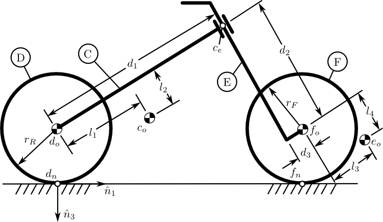
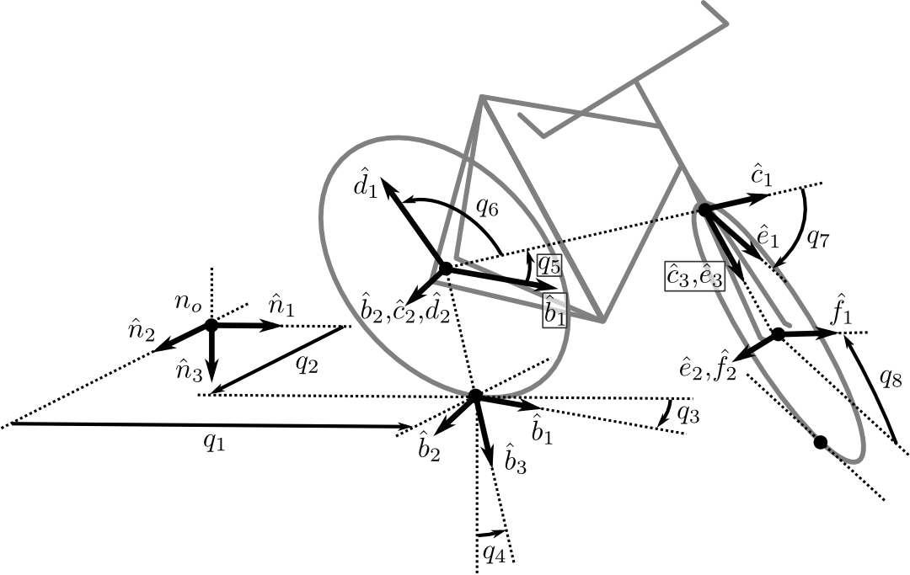

==============================
Carvallo-Whipple Bicycle Model
==============================

.. note::

   You can download this example as a Python script:
   :jupyter-download:script:`carvallo-whipple` or Jupyter notebook:
   :jupyter-download:notebook:`carvallo-whipple`.

This example creates a nonlinear model and simulation of the Carvallo-Whipple
Bicycle Model ([Carvallo1899]_, [Whipple1899]_). This formulation uses the
conventions described in [Moore2012]_ which are equivalent to the models
described in [Meijaard2007]_ and [Basu-Mandal2007]_.

Import the necessary libraries, classes, and functions:

.. jupyter-execute::

   import numpy as np
   from scipy.optimize import fsolve
   import sympy as sm
   import sympy.physics.mechanics as mec
   from pydy.system import System
   from pydy.viz import Sphere, Cylinder, VisualizationFrame, Scene

System Diagrams
===============

   Geometric variable definitions.

   Configuration coordinate definitions.

Reference Frames
================

Use a reference frame that mimics the notation in [Moore2012]_.

.. jupyter-execute::

   class ReferenceFrame(mec.ReferenceFrame):
      """Subclass that enforces the desired unit vector indice style."""

      def __init__(self, *args, **kwargs):

         kwargs.pop('indices', None)
         kwargs.pop('latexs', None)

         lab = args[0].lower()
         tex = r'\hat{{{}}}_{}'

         super(ReferenceFrame, self).__init__(*args,
                                                indices=('1', '2', '3'),
                                                latexs=(tex.format(lab, '1'),
                                                      tex.format(lab, '2'),
                                                      tex.format(lab, '3')),
                                                **kwargs)

Define some useful references frames:

- :math:`N`: Newtonian Frame
- :math:`A`: Yaw Frame, auxiliary frame
- :math:`B`: Roll Frame, axillary frame
- :math:`C`: Rear Frame
- :math:`D`: Rear Wheel Frame
- :math:`E`: Front Frame
- :math:`F`: Front Wheel Frame

.. jupyter-execute::

   N = ReferenceFrame('N')
   A = ReferenceFrame('A')
   B = ReferenceFrame('B')
   C = ReferenceFrame('C')
   D = ReferenceFrame('D')
   E = ReferenceFrame('E')
   F = ReferenceFrame('F')

Generalized Coordinates and Speeds
==================================

All of the following variables are a functions of time, :math:`t`.

- :math:`q_1`: perpendicular distance from the :math:`\hat{n}_2` axis to the
  rear contact point in the ground plane
- :math:`q_2`: perpendicular distance from the :math:`\hat{n}_1` axis to the
  rear contact point in the ground plane
- :math:`q_3`: frame yaw angle
- :math:`q_4`: frame roll angle
- :math:`q_5`: frame pitch angle
- :math:`q_6`: front wheel rotation angle
- :math:`q_7`: steering rotation angle
- :math:`q_8`: rear wheel rotation angle
- :math:`q_9`: perpendicular distance from the :math:`\hat{n}_2` axis to the
  front contact point in the ground plane
- :math:`q_{10}`: perpendicular distance from the :math:`\hat{n}_1` axis to the
  front contact point in the ground plane

.. jupyter-execute::

   q1, q2, q3, q4 = mec.dynamicsymbols('q1 q2 q3 q4')
   q5, q6, q7, q8 = mec.dynamicsymbols('q5 q6 q7 q8')

   u1, u2, u3, u4 = mec.dynamicsymbols('u1 u2 u3 u4')
   u5, u6, u7, u8 = mec.dynamicsymbols('u5 u6 u7 u8')

Orientation of Reference Frames
===============================

Declare the orientation of each frame to define the yaw, roll, and pitch of the
rear frame relative to the Newtonian frame. The define steer of the front frame
relative to the rear frame.

.. jupyter-execute::

   # rear frame yaw
   A.orient(N, 'Axis', (q3, N['3']))
   # rear frame roll
   B.orient(A, 'Axis', (q4, A['1']))
   # rear frame pitch
   C.orient(B, 'Axis', (q5, B['2']))
   # front frame steer
   E.orient(C, 'Axis', (q7, C['3']))

Constants
=========

Declare variables that are constant with respect to time for the model's
physical parameters.

- :math:`r_f`: radius of front wheel
- :math:`r_r`: radius of rear wheel
- :math:`d_1`: the perpendicular distance from the steer axis to the center of
  the rear wheel (rear offset)
- :math:`d_2`: the distance between wheels along the steer axis
- :math:`d_3`: the perpendicular distance from the steer axis to the center of
  the front wheel (fork offset)
- :math:`l_1`: the distance in the :math:`\hat{c}_1` direction from the center
  of the rear wheel to the frame center of mass
- :math:`l_2`: the distance in the :math:`\hat{c}_3` direction from the center of the rear
  wheel to the frame center of mass
- :math:`l_3`: the distance in the :math:`\hat{e}_1` direction from the front
  wheel center to the center of mass of the fork
- :math:`l_4`: the distance in the :math:`\hat{e}_3` direction from the front
  wheel center to the center of mass of the fork

.. jupyter-execute::

   rf, rr = sm.symbols('rf rr')
   d1, d2, d3 = sm.symbols('d1 d2 d3')
   l1, l2, l3, l4 = sm.symbols('l1 l2 l3 l4')

   # acceleration due to gravity
   g = sm.symbols('g')

   # mass
   mc, md, me, mf = sm.symbols('mc md me mf')

   # inertia
   ic11, ic22, ic33, ic31 = sm.symbols('ic11 ic22 ic33 ic31')
   id11, id22 = sm.symbols('id11 id22')
   ie11, ie22, ie33, ie31 = sm.symbols('ie11 ie22 ie33 ie31')
   if11, if22 = sm.symbols('if11 if22')

Specified
=========

Declare three specified torques that are functions of time.

- :math:`T_4` : roll torque, between Newtonian frame and rear frame
- :math:`T_6` : rear wheel torque, between rear wheel and rear frame
- :math:`T_7` : steer torque, between rear frame and front frame

.. jupyter-execute::

   T4, T6, T7 = mec.dynamicsymbols('T4 T6 T7')

Position Vectors
================

.. jupyter-execute::

   # rear wheel contact point
   dn = mec.Point('dn')

   # rear wheel contact point to rear wheel center
   do = mec.Point('do')
   do.set_pos(dn, -rr * B['3'])

   # rear wheel center to bicycle frame center
   co = mec.Point('co')
   co.set_pos(do, l1 * C['1'] + l2 * C['3'])

   # rear wheel center to steer axis point
   ce = mec.Point('ce')
   ce.set_pos(do, d1 * C['1'])

   # steer axis point to the front wheel center
   fo = mec.Point('fo')
   fo.set_pos(ce, d2 * E['3'] + d3 * E['1'])

   # front wheel center to front frame center
   eo = mec.Point('eo')
   eo.set_pos(fo, l3 * E['1'] + l4 * E['3'])

   # locate the point fixed on the wheel which instantaneously touches the
   # ground
   fn = mec.Point('fn')
   fn.set_pos(fo, rf * E['2'].cross(A['3']).cross(E['2']).normalize())

Holonomic Constraint
====================

The front contact point :math:`f_n` and the rear contact point :math:`d_n` must
both reside in the ground plane.

.. jupyter-execute::

   holonomic = fn.pos_from(dn).dot(A['3'])

This expression defines a configuration constraint among :math:`q_4`,
:math:`q_5`, and :math:`q_7`.

.. jupyter-execute::

   mec.find_dynamicsymbols(holonomic)

Kinematical Differential Equations
==================================

Define the generalized speeds all as :math:`u=\dot{q}`.

.. jupyter-execute::

   t = mec.dynamicsymbols._t

   kinematical = [q3.diff(t) - u3,  # yaw
                  q4.diff(t) - u4,  # roll
                  q5.diff(t) - u5,  # pitch
                  q7.diff(t) - u7]  # steer

Angular Velocities
==================

.. jupyter-execute::

   A.set_ang_vel(N, u3 * N['3'])  # yaw rate
   B.set_ang_vel(A, u4 * A['1'])  # roll rate
   C.set_ang_vel(B, u5 * B['2'])  # pitch rate
   D.set_ang_vel(C, u6 * C['2'])  # rear wheel rate
   E.set_ang_vel(C, u7 * C['3'])  # steer rate
   F.set_ang_vel(E, u8 * E['2'])  # front wheel rate

Linear Velocities
=================

.. jupyter-execute::

   # rear wheel contact stays in ground plane and does not slip
   dn.set_vel(N, 0.0 * N['1'])

   # mass centers
   do.v2pt_theory(dn, N, D)
   co.v2pt_theory(do, N, C)
   ce.v2pt_theory(do, N, C)
   fo.v2pt_theory(ce, N, E)
   eo.v2pt_theory(fo, N, E)

   # wheel contact velocities
   fn.v2pt_theory(fo, N, F);  # supress output

Motion Constraints
==================

Enforce the no slip condition at the front wheel contact point. Note that the
no-slip condition is already enforced with the velocity of :math:`n_o` set to
0. Also include an extra motion constraint not allowing vertical motion of the
contact point. Note that this is an integrable constraint, i.e. the derivative
of ``nonholonomic`` above. It is not a nonholonomic constraint, but we include
it because we can't easy eliminate a dependent generalized coordinate with
``nonholonmic``.

.. warning:: The floating point numerical stability of the solution is affected
   by the order of the nonholonomic constraint expressions in the following
   list. If ordered ``A['1'],A['2'],A['3']`` stability degrades.

.. jupyter-execute::

   nonholonomic = [
       fn.vel(N).dot(A['1']),
       fn.vel(N).dot(A['3']),
       fn.vel(N).dot(A['2']),
   ]

Inertia
=======

The inertia dyadics are defined with respect to the rear and front frames.

.. jupyter-execute::

   Ic = mec.inertia(C, ic11, ic22, ic33, 0.0, 0.0, ic31)
   Id = mec.inertia(C, id11, id22, id11, 0.0, 0.0, 0.0)
   Ie = mec.inertia(E, ie11, ie22, ie33, 0.0, 0.0, ie31)
   If = mec.inertia(E, if11, if22, if11, 0.0, 0.0, 0.0)

Rigid Bodies
============

.. jupyter-execute::

   rear_frame = mec.RigidBody('Rear Frame', co, C, mc, (Ic, co))
   rear_wheel = mec.RigidBody('Rear Wheel', do, D, md, (Id, do))
   front_frame = mec.RigidBody('Front Frame', eo, E, me, (Ie, eo))
   front_wheel = mec.RigidBody('Front Wheel', fo, F, mf, (If, fo))

   bodies = [rear_frame, rear_wheel, front_frame, front_wheel]

Loads
=====

.. jupyter-execute::

   # gravity
   Fco = (co, mc*g*A['3'])
   Fdo = (do, md*g*A['3'])
   Feo = (eo, me*g*A['3'])
   Ffo = (fo, mf*g*A['3'])

   # input torques
   Tc = (C, T4*A['1'] - T6*B['2'] - T7*C['3'])
   Td = (D, T6*C['2'])
   Te = (E, T7*C['3'])

   loads = [Fco, Fdo, Feo, Ffo, Tc, Td, Te]

Kane's Method
=============

.. jupyter-execute::

   kane = mec.KanesMethod(N,
                          [q3, q4, q7],  # yaw, roll, steer
                          [u4, u6, u7],  # roll rate, rear wheel rate, steer rate
                          kd_eqs=kinematical,
                          q_dependent=[q5],  # pitch angle
                          configuration_constraints=[holonomic],
                          u_dependent=[u3, u5, u8],  # yaw rate, pitch rate, front wheel rate
                          velocity_constraints=nonholonomic)

   fr, frstar = kane.kanes_equations(bodies, loads)

Simulating the system
=====================

PyDy's ``System`` is a wrapper that holds the ``KanesMethod`` object to
integrate the equations of motion using numerical values of constants.

.. jupyter-execute::

    from pydy.system import System
    sys = System(kane)

Now, we specify the numerical values of the constants and the initial values of
states in the form of a dict. The are the benchmark values used in
[Meijaard2007]_ converted to the [Moore2012]_ formulation.

.. jupyter-execute::

    sys.constants = {
       rf: 0.35,
       rr: 0.3,
       d1: 0.9534570696121849,
       d3: 0.03207142672761929,
       d2: 0.2676445084476887,
       l1: 0.4707271515135145,
       l2: -0.47792881146460797,
       l4: -0.3699518200282974,
       l3: -0.00597083392418685,
       mc: 85.0,
       md: 2.0,
       me: 4.0,
       mf: 3.0,
       id11: 0.0603,
       id22: 0.12,
       if11: 0.1405,
       if22: 0.28,
       ic11: 7.178169776497895,
       ic22: 11.0,
       ic31: 3.8225535938357873,
       ic33: 4.821830223502103,
       ie11: 0.05841337700152972,
       ie22: 0.06,
       ie31: 0.009119225261946298,
       ie33: 0.007586622998470264,
       g: 9.81
    }

Setup the initial conditions such that the bicycle is traveling at some forward
speeds and has an initial positive roll rate.

.. jupyter-execute::

    initial_speed = 4.6  # m/s
    initial_roll_rate = 0.5  # rad/s

The initial configuration will be the upright equilibrium position. The
holonomic constraint requires that either the roll, pitch, or steer angle need
be dependent. Below, the pitch angle is taken as dependent and solved for using
`fsolve()`. Note that it is equivalent to the steer axis tilt [Meijaard2007]_.

.. jupyter-execute::

    eval_holonomic = sm.lambdify((q5, q4, q7, d1, d2, d3, rf, rr), holonomic)
    initial_pitch_angle = float(fsolve(eval_holonomic, 0.0,
                                       args=(0.0,  # q4
                                             1e-8,  # q7
                                             sys.constants[d1],
                                             sys.constants[d2],
                                             sys.constants[d3],
                                             sys.constants[rf],
                                             sys.constants[rr])))
    np.rad2deg(initial_pitch_angle)

Set all of the initial conditions.

.. warning::

   A divide-by-zero will occur if the steer angle is set to zero. Thus the
   `1e-8` values. The integration is also sensitive to the size of this value.
   This shouldn't be the case and may point to some errors in the derivation
   and implementation. More careful attention to the integration tolerances may
   help too.

.. jupyter-execute::

    sys.initial_conditions = {q3: 0.0,
                              q4: 0.0,
                              q5: initial_pitch_angle,
                              q7: 1e-8,
                              u3: 0.0,
                              u4: initial_roll_rate,
                              u5: 0.0,
                              u6: -initial_speed/sys.constants[rr],
                              u7: 0.0,
                              u8: -initial_speed/sys.constants[rf]}

Generate a time vector over which the integration will be carried out.

.. jupyter-execute::

    fps = 30  # frames per second
    duration = 6.0  # seconds
    sys.times = np.linspace(0.0, duration, num=int(duration*fps))

The trajectory of the states over time can be found by calling the
``.integrate()`` method. But due to the complexity of the equations of motion
it is helpful to use the `cython` generator for faster numerical evaluation.

.. warning::

   The holonomic constraint equation is not explicitly enforced, as PyDy does
   not yet support integration of differential algebraic equations (DAEs) yet.
   The solution will drift from the true solution over time with magnitudes
   dependent on the intiial conditions and constants values.

.. jupyter-execute::

   sys.generate_ode_function(generator='cython')

   x_trajectory = sys.integrate()

Evaluate the holonomic constraint across the simulation.

.. jupyter-execute::

   holonomic_vs_time  = eval_holonomic(x_trajectory[:, 3],  # q5
                                       x_trajectory[:, 1],  # q4
                                       x_trajectory[:, 2],  # q7
                                       sys.constants[d1],
                                       sys.constants[d2],
                                       sys.constants[d3],
                                       sys.constants[rf],
                                       sys.constants[rr])

Plot the State Trajectories
===========================

.. jupyter-execute::

   import matplotlib.pyplot as plt
   fig, axes = plt.subplots(len(sys.states) + 1, 1, sharex=True)
   fig.set_size_inches(8, 10)
   for ax, traj, s in zip(axes, x_trajectory.T, sys.states):
       ax.plot(sys.times, traj)
       ax.set_ylabel(s)
   axes[-1].plot(sys.times, np.squeeze(holonomic_vs_time))
   axes[-1].set_ylabel('Holonomic\nconstraint [m]')
   axes[-1].set_xlabel('Time [s]')
   plt.tight_layout()

Visualizing the System Motion
=============================

Create two cylinders to represent the front and rear wheels.

.. jupyter-execute::

   rear_wheel_circle = Cylinder(radius=sys.constants[rr], length=0.01,
                                color="green", name='rear wheel')
   front_wheel_circle = Cylinder(radius=sys.constants[rf], length=0.01,
                                 color="green", name='front wheel')
   rear_wheel_vframe = VisualizationFrame(B, do, rear_wheel_circle)
   front_wheel_vframe = VisualizationFrame(E, fo, front_wheel_circle)

Create some cylinders to represent the front and rear frames.

.. jupyter-execute::

   d1_cylinder = Cylinder(radius=0.02, length=sys.constants[d1],
                          color='black', name='rear frame d1')
   d2_cylinder = Cylinder(radius=0.02, length=sys.constants[d2],
                          color='black', name='front frame d2')
   d3_cylinder = Cylinder(radius=0.02, length=sys.constants[d3],
                          color='black', name='front frame d3')

   d1_frame = VisualizationFrame(C.orientnew('C_r', 'Axis', (sm.pi/2, C.z)),
                                 do.locatenew('d1_half', d1/2*C.x), d1_cylinder)
   d2_frame = VisualizationFrame(E.orientnew('E_r', 'Axis', (-sm.pi/2, E.x)),
                                 fo.locatenew('d2_half', -d3*E.x - d2/2*E.z), d2_cylinder)
   d3_frame = VisualizationFrame(E.orientnew('E_r', 'Axis', (sm.pi/2, E.z)),
                                 fo.locatenew('d3_half', -d3/2*E.x), d3_cylinder)

Create some spheres to represent the mass centers of the front and rear frames.

.. jupyter-execute::

   co_sphere = Sphere(radius=0.05, color='blue', name='rear frame co')
   eo_sphere = Sphere(radius=0.05, color='blue', name='rear frame eo')
   co_frame = VisualizationFrame(C, co, co_sphere)
   eo_frame = VisualizationFrame(E, eo, eo_sphere)

Create the scene and add the visualization frames.

.. jupyter-execute::

    scene = Scene(N, dn, system=sys)
    scene.visualization_frames = [front_wheel_vframe, rear_wheel_vframe,
                                  d1_frame, d2_frame, d3_frame,
                                  co_frame, eo_frame]

Now, call the display method.

.. jupyter-execute::

    scene.display_jupyter(axes_arrow_length=5.0)

References
==========

.. [Whipple1899] Whipple, Francis J. W. "The Stability of the Motion of a
   Bicycle." Quarterly Journal of Pure and Applied Mathematics 30 (1899): 312–48.
.. [Carvallo1899] Carvallo, E. Théorie Du Mouvement Du Monocycle et de La
   Bicyclette. Paris, France: Gauthier- Villars, 1899.
.. [Moore2012] Moore, Jason K. "Human Control of a Bicycle." Doctor of
   Philosophy, University of California, 2012.
   http://moorepants.github.io/dissertation.
.. [Meijaard2007] Meijaard, J. P., Jim M. Papadopoulos, Andy Ruina, and A. L.
   Schwab. "Linearized Dynamics Equations for the Balance and Steer of a
   Bicycle: A Benchmark and Review." Proceedings of the Royal Society A:
   Mathematical, Physical and Engineering Sciences 463, no. 2084 (August 8,
   2007): 1955–82.
.. [Basu-Mandal2007] Basu-Mandal, Pradipta, Anindya Chatterjee, and J.M
   Papadopoulos. "Hands-Free Circular Motions of a Benchmark Bicycle."
   Proceedings of the Royal Society A: Mathematical, Physical and Engineering
   Sciences 463, no. 2084 (August 8, 2007): 1983–2003.
   https://doi.org/10.1098/rspa.2007.1849.
