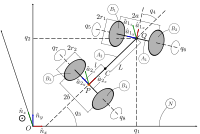

==============================================================================================
Modeling of a Variable-Mass Nonholonomic Gyrostatic Rocket Car Using Extended Kane’s Equations
==============================================================================================

.. note::

    You can download this example as a Python script:
    :jupyter-download:script:`rocket-car` or Jupyter notebook:
    :jupyter-download:notebook:`rocket-car`.

This is an implementation of the nonholonomic rocket-engine-powered jet racing car example from [Ge1982]_. This example provides insight into analytically modeling variable-mass systems using Kane's method and the extended Kane's equations for variable-mass systems. It also demonstrates the efficacy of Kane's method in the modeling of complex dynamical systems. 

An idealized model of a jet racing car that is propelled by a rocket
engine at point P is considered. The rocket engine is treated as a
variable-mass particle at P.

Here, :math:`\{a_x: g_3, a_y: g_1, a_z: g_2\}`

.. jupyter-execute::

    import sympy as sm
    import sympy.physics.mechanics as me
    from pydy.system import System
    import numpy as np
    from sympy.simplify.fu import TR2
    import matplotlib.pyplot as plt
    from scipy.integrate import odeint
    me.init_vprinting()

    from IPython.display import Latex, display
    def print_answer(x, x_res):
        for xi, xri in zip(x, x_res):
            display(Latex(sm.latex(sm.Eq(xi, xri), mode='inline')))

Reference Frames, Generalized Coordinates, and Generalized Speeds
-----------------------------------------------------------------

.. jupyter-execute::

    N = me.ReferenceFrame('N')
    
    q1, q2, q3, q4, q5, q6, q7, q8 = me.dynamicsymbols('q1:9')
    
    A2 = N.orientnew('A_2', 'Axis', [q3, N.z])
    A1 = A2.orientnew('A_1', 'Axis', [q4, A2.z])
    
    B1 = A1.orientnew('B_1', 'Axis', [q5, A1.y])
    B2 = A1.orientnew('B_2', 'Axis', [q6, A1.y])
    B3 = A2.orientnew('B_3', 'Axis', [q7, A2.y])
    B4 = A2.orientnew('B_4', 'Axis', [q8, A2.y])
    
    t = me.dynamicsymbols._t

.. jupyter-execute::

    O = me.Point('O') # fixed point in the inertial reference frame
    O.set_vel(N, 0)

.. jupyter-execute::

    L, l , a, b, r1, r2 = sm.symbols('L, l , a, b, r_1, r_2')

.. jupyter-execute::

    Q = O.locatenew('Q', q1 * N.x + q2 * N.y)

.. jupyter-execute::

    P = Q.locatenew('P', L * -A2.x)

.. jupyter-execute::

    C = P.locatenew('C', l * A2.x)

.. jupyter-execute::

    Q.set_vel(N, Q.pos_from(O).dt(N))
    Q.vel(N)

.. jupyter-execute::

    P.v2pt_theory(Q, N, A2)
    P.vel(N)

.. jupyter-execute::

    C.v2pt_theory(P, N, A2)
    # C.vel(N)

.. jupyter-execute::

    A1.ang_vel_in(A2).express(A1)

.. jupyter-execute::

    u1, u2 = me.dynamicsymbols('u_1:3')

.. jupyter-execute::

    z1 = sm.Eq(u1, A1.ang_vel_in(A2).dot(A1.z))
    z2 = sm.Eq(u2, Q.vel(N).dot(A1.x))

.. jupyter-execute::

    u = sm.trigsimp(sm.solve([z1, z2], A1.ang_vel_in(A2).dot(A1.z), Q.vel(N).dot(A1.x)))
    u

Formulation of the Constraint Equations
---------------------------------------

Nonholonomic Constraints: :math:`B_1`
~~~~~~~~~~~~~~~~~~~~~~~~~~~~~~~~~~~~~

.. jupyter-execute::

    B1_center = Q.locatenew('B_1_center', a * A1.y)
    B1_center.pos_from(Q)

.. jupyter-execute::

    B1_center.v2pt_theory(Q, N, A1)
    B1_center.vel(N).express(A1).simplify()

.. jupyter-execute::

    B1_ground = B1_center.locatenew('B_1_ground', r1 * -A1.z)
    B1_ground.pos_from(B1_center)

.. jupyter-execute::

    B1_ground.v2pt_theory(B1_center, N, B1)
    B1_ground.vel(N).simplify()

.. jupyter-execute::

    B1_cons = [me.dot(B1_ground.vel(N).simplify(), uv) for uv in A1]
    for i in range(len(B1_cons)):
        display(sm.trigsimp(B1_cons[i]))

.. jupyter-execute::

    eq1 = sm.Eq(B1_cons[0].simplify().subs(u), 0)
    eq1

.. jupyter-execute::

    eq2 = sm.Eq(B1_cons[1].simplify().subs(u), 0)
    eq2

Nonholonomic Constraints: :math:`B_2`
~~~~~~~~~~~~~~~~~~~~~~~~~~~~~~~~~~~~~

.. jupyter-execute::

    B2_center = Q.locatenew('B_1_center', a * -A1.y)
    B2_center.pos_from(Q)

.. jupyter-execute::

    B2_center.v2pt_theory(Q, N, A1)
    B2_center.vel(N).express(A1).simplify()

.. jupyter-execute::

    B2_ground = B2_center.locatenew('B_2_ground', r1 * -A1.z)
    B2_ground.pos_from(B2_center)

.. jupyter-execute::

    B2_ground.v2pt_theory(B2_center, N, B2)
    B2_ground.vel(N).simplify()

.. jupyter-execute::

    B2_cons = [me.dot(B2_ground.vel(N).simplify(), uv) for uv in A1]
    for i in range(len(B2_cons)):
        display(sm.trigsimp(B2_cons[i]))

.. jupyter-execute::

    eq3 = sm.Eq(B2_cons[0].simplify().subs(u), 0)
    eq3

.. jupyter-execute::

    eq4 = sm.Eq(B2_cons[1].simplify().subs(u), 0)
    eq4

Nonholonomic Constraints: :math:`B_3`
~~~~~~~~~~~~~~~~~~~~~~~~~~~~~~~~~~~~~

.. jupyter-execute::

    B3_center = P.locatenew('B_3_center', b * A2.y)
    B3_center.pos_from(P)

.. jupyter-execute::

    B3_center.v2pt_theory(P, N, A2)
    B3_center.vel(N).express(A2).simplify()

.. jupyter-execute::

    B3_ground = B3_center.locatenew('B_3_ground', r2 * -A2.z)
    B3_ground.pos_from(B3_center)

.. jupyter-execute::

    B3_ground.v2pt_theory(B3_center, N, B3)
    B3_ground.vel(N).simplify()

.. jupyter-execute::

    B3_cons = [me.dot(B3_ground.vel(N).simplify(), uv) for uv in A2]
    for i in range(len(B3_cons)):
        display(sm.trigsimp(B3_cons[i]))

.. jupyter-execute::

    eq5 = sm.Eq(B3_cons[0].simplify().subs(u), 0)
    eq5

.. jupyter-execute::

    eq6 = sm.Eq(B3_cons[1].simplify().subs(u), 0)
    eq6

Nonholonomic Constraints: :math:`B_4`
~~~~~~~~~~~~~~~~~~~~~~~~~~~~~~~~~~~~~

.. jupyter-execute::

    B4_center = P.locatenew('B_4_center', b * -A2.y)
    B4_center.pos_from(P)

.. jupyter-execute::

    B4_center.v2pt_theory(P, N, A2)
    B4_center.vel(N).express(A2).simplify()

.. jupyter-execute::

    B4_ground = B4_center.locatenew('B_4_ground', r2 * -A2.z)
    B4_ground.pos_from(B4_center)

.. jupyter-execute::

    B4_ground.v2pt_theory(B4_center, N, B4)
    B4_ground.vel(N).simplify()

.. jupyter-execute::

    B4_cons = [me.dot(B4_ground.vel(N).simplify(), uv) for uv in A2]
    for i in range(len(B4_cons)):
        display(sm.trigsimp(B4_cons[i]))

.. jupyter-execute::

    eq7 = sm.Eq(B4_cons[0].simplify().subs(u), 0)
    eq7

.. jupyter-execute::

    eq8 = sm.Eq(B4_cons[1].simplify().subs(u), 0)
    eq8

:math:`\text{LHS} \Longleftrightarrow \text{RHS}\ \text{in}\ z_1, z_2 \rightarrow \text{Equations}\ 9, 10`

.. jupyter-execute::

    eq9 = sm.Eq(A1.ang_vel_in(A2).dot(A1.z), u1)
    eq9

.. jupyter-execute::

    eq10 = sm.Eq(Q.vel(N).dot(A1.x), u2)
    eq10

Solving the System of Linear Equations
--------------------------------------

The system of equations is linear in :math:`\dot{q}_1, \dot{q}_2,...`

Note: ``eq4`` :math:`\equiv` ``eq2``; ``eq8`` :math:`\equiv` ``eq6``

.. jupyter-execute::

    solution = sm.linsolve([eq1, eq2, eq3, eq5, eq6, eq7, eq9, eq10], q1.diff(), q2.diff(), q3.diff(),  q4.diff(), q5.diff(), q6.diff(), q7.diff(), q8.diff())

.. jupyter-execute::

    sollist_keys = [q1.diff(), q2.diff(), q3.diff(),  q4.diff(), q5.diff(), q6.diff(), q7.diff(), q8.diff()]
    sollist_keys

.. jupyter-execute::

    sollist_values = list(solution.args[0])

.. jupyter-execute::

    sollist_values_simple = []
    for i in range(len(sollist_values)):
        sollist_values_simple.append(sm.factor(TR2(sollist_values[i]).simplify()))

.. jupyter-execute::

    soldict = dict(zip(sollist_keys, sollist_values_simple)) 
    print_answer(sollist_keys, sollist_values_simple)

Reformulated Velocity and Angular Velocity Expressions
------------------------------------------------------

.. jupyter-execute::

    N_v_Q = Q.vel(N).subs(soldict).express(A1).simplify()
    N_v_Q

.. jupyter-execute::

    N_v_P = P.vel(N).subs(soldict).express(A2).simplify()
    N_v_P

.. jupyter-execute::

    N_v_C = C.vel(N).subs(soldict).express(A2).simplify()
    N_v_C

.. jupyter-execute::

    N_w_A1 = A1.ang_vel_in(N).subs(soldict).express(A1).simplify()
    N_w_A1

.. jupyter-execute::

    N_w_A2 = A2.ang_vel_in(N).subs(soldict).express(A2).simplify()
    N_w_A2

Partial Velocities and Partial Angular Velocities
-------------------------------------------------

.. jupyter-execute::

    V_1_Q = N_v_Q.diff(u1, N)
    V_1_Q

.. jupyter-execute::

    V_2_Q = N_v_Q.diff(u2, N)
    V_2_Q

.. jupyter-execute::

    V_1_C = N_v_C.diff(u1, N)
    V_1_C

.. jupyter-execute::

    V_2_C = N_v_C.diff(u2, N)
    V_2_C

.. jupyter-execute::

    V_1_P = N_v_P.diff(u1, N)
    V_1_P

.. jupyter-execute::

    V_2_P = N_v_P.diff(u2, N)
    V_2_P

.. jupyter-execute::

    w_1_A1 = N_w_A1.diff(u1, N)
    w_1_A1

.. jupyter-execute::

    w_2_A1 = N_w_A1.diff(u2, N)
    w_2_A1

.. jupyter-execute::

    w_1_A2 = N_w_A2.diff(u1, N)
    w_1_A2

.. jupyter-execute::

    w_2_A2 = N_w_A2.diff(u2, N)
    w_2_A2

Accelerations and Angular Accelerations
---------------------------------------

.. jupyter-execute::

    a_1__P, a_2__P, a_3__P, a_1__C, a_2__C, a_3__C, a__Q, alpha__A1, alpha__A2 = sm.symbols('a_1__P, a_2__P, a_3__P, a_1__C, a_2__C, a_3__C, a__Q, alpha__A1, alpha__A2')

.. jupyter-execute::

    N_a_P = N_v_P.dt(N).subs(soldict)
    N_a_P

.. jupyter-execute::

    N_a_C = N_v_C.dt(N).subs(soldict)
    N_a_C

.. jupyter-execute::

    N_a_Q = N_v_Q.dt(N).subs(soldict)
    N_a_Q

.. jupyter-execute::

    N_aa_A1 = N_w_A1.dt(N).subs(soldict)
    N_aa_A1

.. jupyter-execute::

    N_aa_A2 = N_w_A2.dt(N).subs(soldict)
    N_aa_A2

Forces and Torques
------------------

:math:`(F_r^*)_G = (F_r^*)_{GR} + (F_r^*)_{GI}`

where,

:math:`(F_r^*)_{GR} = {V_r}^G \cdot {F_G}^* + \omega_r^A \cdot {T_G}^*`

:math:`F_G^* = -m_G {a^G}^*`

:math:`T_G^* \overset{\Delta}{=} -[\alpha_A \cdot I_G + \omega_r^A \times (I_G \cdot \omega_r^A)]`

:math:`({F_r}^*)_{GI} = -J\{\omega_r^A [\ddot{q_k} g_1 + \dot{q_k} (\omega_3^A g_2 - \omega_2^A g_3)] + C_{kr} (\dot{\omega_1^A} + \ddot{q_k}) \}`

[Kane1978]_

Naming Convention:

:math:`({F_r}^*)_{G_n R}` (rigid)

:math:`({F_r}^*)_{G_n I}` (internal)

Masses and Moments of Inertia
-----------------------------

.. jupyter-execute::

    M1, M2 = sm.symbols('M_1, M_2')
    m = me.dynamicsymbols('m')

.. jupyter-execute::

    I1x, I1y, I1z = sm.symbols('I_{1_x}, I_{1_y}, I_{1_z}')
    I2x, I2y, I2z = sm.symbols('I_{2_x}, I_{2_y}, I_{2_z}')
    J1, J2 = sm.symbols('J_1, J_2')

.. jupyter-execute::

    I1 = me.inertia(A1, I1x, I1y, I1z)
    I1

.. jupyter-execute::

    I2 = me.inertia(A2, I2x, I2y, I2z)
    I2

Gyrostat :math:`G_1`
--------------------

:math:`\rightarrow {F_G}^* = -m_G {a^G}^*`

.. jupyter-execute::

    Fstar_G1 = -M1 * N_a_Q
    Fstar_G1

:math:`\rightarrow {T_G}^* \overset{\Delta}{=} -[\alpha_A \cdot I_G + {\omega_r}^A \times (I_G \cdot {\omega_r}^A)]`

.. jupyter-execute::

    Tstar_G1 = -(N_aa_A1.dot(I1) + me.cross(N_w_A1, I1.dot(N_w_A1)))
    Tstar_G1

:math:`\rightarrow ({F_r}^*)_{GR} = {V_r}^G \cdot {F_G}^* + {\omega_r}^A \cdot {T_G}^*`

.. jupyter-execute::

    Fstar_1_G1_R = V_1_Q.dot(Fstar_G1) + w_1_A1.dot(Tstar_G1).subs(soldict)
    Fstar_1_G1_R.subs({N_w_A1.dt(N).subs(soldict).dot(A1.z): alpha__A1})

.. jupyter-execute::

    Fstar_2_G1_R = V_2_Q.dot(Fstar_G1) + w_2_A1.dot(Tstar_G1).subs(soldict)
    Fstar_2_G1_R.subs({N_w_A1.dt(N).subs(soldict).dot(A1.z): alpha__A1})

:math:`\rightarrow (F_r^*)_{GI} = -J\{\omega_r^A \cdot [\ddot{q_k} g_1 + \dot{q_k} (\omega_3^A g_2 - \omega_2^A g_3)] + C_{kr} (\dot{\omega}_1^A + \ddot{q_k}) \} \qquad (r=1,...,n-m)`

Here,
:math:`\{\omega_1^A: \omega_2^A,\ \omega_2^A: \omega_3^A,\ \omega_3^A: \omega_1^A\}`

:math:`\rightarrow \dot{q_k} = \sum_{s = 1}^{n - m} C_{ks} u_s + D_k`
(Generalized Speeds)

:math:`\omega_i^A \overset{\Delta}{=} \omega^A \cdot \hat{g}_i \quad (i = 1, 2, 3)`

.. jupyter-execute::

    # C_kr
    C51, C61 = sm.symbols('C_51, C_61')
    C_51 = soldict[q5.diff()].diff(u1)
    C_61 = soldict[q6.diff()].diff(u1)
    Fstar_1_G1_I = -J1 * (N_w_A1.dot(q5.diff().diff() * A1.y + q5.diff()*(N_w_A1.dot(A1.x)*A1.z - N_w_A1.dot(A1.z)*A1.x)) + C_51 * (N_w_A1.dot(A1.y).diff() + q5.diff().diff())) \
                   -J1 * (N_w_A1.dot(q6.diff().diff() * A1.y + q6.diff()*(N_w_A1.dot(A1.x)*A1.z - N_w_A1.dot(A1.z)*A1.x)) + C_61 * (N_w_A1.dot(A1.y).diff() + q6.diff().diff()))   # B1 \ B2
    
    Fstar_1_G1_I, C_51, C_61, Fstar_1_G1_I.subs({-C_51: -C51, -C_61: -C61}).simplify()

.. jupyter-execute::

    # C_kr 
    C52, C62 = sm.symbols('C_52, C_62')
    C_52 = soldict[q5.diff()].diff(u2)
    C_62 = soldict[q6.diff()].diff(u2)
    Fstar_2_G1_I = -J1 * (N_w_A1.dot(q5.diff().diff() * A1.y + q5.diff()*(N_w_A1.dot(A1.x)*A1.z - N_w_A1.dot(A1.z)*A1.x)) + C_52 * (N_w_A1.dot(A1.y).diff() + q5.diff().diff())) \
                   -J1 * (N_w_A1.dot(q6.diff().diff() * A1.y + q6.diff()*(N_w_A1.dot(A1.x)*A1.z - N_w_A1.dot(A1.z)*A1.x)) + C_62 * (N_w_A1.dot(A1.y).diff() + q6.diff().diff()))   # B1 \ B2
    
    display(Fstar_2_G1_I),
    display(C_52)
    display(C_62)
    display(Fstar_2_G1_I.subs({-C_52: -C52, -C_62: -C62}).simplify())

:math:`\rightarrow (F_r^*)_G = (F_r^*)_{GR} + (F_r^*)_{GI}`

.. jupyter-execute::

    Fstar_1_G1 = Fstar_1_G1_R + Fstar_1_G1_I
    Fstar_1_G1.subs({N_w_A1.dt(N).subs(soldict).dot(A1.z): alpha__A1}).subs({-C_51: -C51, -C_61: -C61}).simplify()

.. jupyter-execute::

    Fstar_2_G1 = Fstar_2_G1_R + Fstar_2_G1_I
    Fstar_2_G1.subs({N_w_A1.dt(N).subs(soldict).dot(A1.z): alpha__A1}).subs({-C_52: -C52, -C_62: -C62}).simplify()

Gyrostat :math:`G_2`
--------------------

:math:`\rightarrow {F_G}^* = -m_G {a^G}^*`

.. jupyter-execute::

    Fstar_G2 = -M2 * N_a_C
    Fstar_G2

:math:`\rightarrow {T_G}^* \overset{\Delta}{=} -[\alpha_A \cdot I_G + {\omega_r}^A \times (I_G \cdot {\omega_r}^A)]`

.. jupyter-execute::

    Tstar_G2 = -(N_aa_A2.dot(I2) + me.cross(N_w_A2, I2.dot(N_w_A2)))
    Tstar_G2

:math:`\rightarrow ({F_r}^*)_{GR} = {V_r}^G \cdot {F_G}^* + {\omega_r}^A \cdot {T_G}^*`

.. jupyter-execute::

    Fstar_1_G2_R = V_1_C.dot(Fstar_G2) + w_1_A2.dot(Tstar_G2).subs(soldict)
    Fstar_1_G2_R.subs({N_w_A2.dt(N).subs(soldict).dot(A2.z): alpha__A2})

.. jupyter-execute::

    Fstar_2_G2_R = V_2_C.dot(Fstar_G2) + w_2_A1.dot(Tstar_G2).subs(soldict)
    Fstar_2_G2_R.subs({N_w_A2.dt(N).subs(soldict).dot(A2.z): alpha__A2})

:math:`\rightarrow (F_r^*)_{GI} = -J\{\omega_r^A \cdot [\ddot{q_k} g_1 + \dot{q_k} (\omega_3^A g_2 - \omega_2^A g_3)] + C_{kr} (\dot{\omega}_1^A + \ddot{q_k}) \} \qquad (r=1,...,n-m)`

Here,
:math:`\{\omega_1^A: \omega_2^A,\ \omega_2^A: \omega_3^A,\ \omega_3^A: \omega_1^A\}`

:math:`\rightarrow \dot{q_k} = \sum_{s = 1}^{n - m} C_{ks} u_s + D_k`
(Generalized Speeds)

:math:`\omega_i^A \overset{\Delta}{=} \omega^A \cdot \hat{g}_i \quad (i = 1, 2, 3)`

.. jupyter-execute::

    # C_kr
    C71, C81 = sm.symbols('C_71, C_81')
    C_71 = soldict[q7.diff()].diff(u1)
    C_81 = soldict[q8.diff()].diff(u1)
    Fstar_1_G2_I = -J2 * (N_w_A2.dot(q7.diff().diff() * A2.y + q7.diff()*(N_w_A2.dot(A2.x)*A2.z - N_w_A2.dot(A2.z)*A2.x)) + C_71 * (N_w_A2.dot(A2.y).diff() + q7.diff().diff())) \
                   -J2 * (N_w_A2.dot(q8.diff().diff() * A2.y + q8.diff()*(N_w_A2.dot(A2.x)*A2.z - N_w_A2.dot(A2.z)*A2.x)) + C_81 * (N_w_A2.dot(A2.y).diff() + q8.diff().diff()))   # B1 \ B2
    
    Fstar_1_G2_I, C_71, C_81, # Fstar_1_G2_I.subs({-C_71: -C71, -C_81: -C81}).simplify()

.. jupyter-execute::

    # C_kr 
    C72, C82 = sm.symbols('C_72, C_82')
    C_72 = soldict[q7.diff()].diff(u2)
    C_82 = soldict[q8.diff()].diff(u2)
    Fstar_2_G2_I = -J2 * (N_w_A2.dot(q7.diff().diff() * A2.y + q7.diff()*(N_w_A2.dot(A2.x)*A2.z - N_w_A2.dot(A2.z)*A2.x)) + C_72 * (N_w_A2.dot(A2.y).diff() + q7.diff().diff())) \
                   -J2 * (N_w_A2.dot(q8.diff().diff() * A2.y + q8.diff()*(N_w_A2.dot(A2.x)*A2.z - N_w_A2.dot(A2.z)*A2.x)) + C_82 * (N_w_A2.dot(A2.y).diff() + q8.diff().diff()))   # B1 \ B2
    
    display(Fstar_2_G2_I) 
    display(C_72) 
    display(C_82)
    display(Fstar_2_G2_I.subs({-C_72: -C72, -C_82: -C82}).simplify())

:math:`\rightarrow (F_r^*)_G = (F_r^*)_{GR} + (F_r^*)_{GI}`

.. jupyter-execute::

    Fstar_1_G2 = Fstar_1_G2_R + Fstar_1_G2_I
    # Fstar_1_G2.subs({N_w_A2.dt(N).subs(soldict).dot(A2.z): alpha__A2}) # .subs({-C_71: -C71, -C_81: -C81}).simplify()
    Fstar_1_G2 = 0

Here, :math:`\{a_1^C: a_2^C,\ a_2^C: a_3^C,\ a_3^C: a_1^C\}`

.. jupyter-execute::

    Fstar_2_G2 = Fstar_2_G2_R + Fstar_2_G2_I
    Fstar_2_G2.subs({N_w_A2.dt(N).subs(soldict).dot(A2.z): alpha__A2}).subs({N_v_C.dt(N).subs(soldict).dot(A2.x): a_3__C}).subs({N_v_C.dt(N).subs(soldict).dot(A2.y): a_1__C}).subs({-C_72: -C72, -C_82: -C82}).simplify()

Variable-Mass Particle, :math:`P`
---------------------------------

:math:`\rightarrow {F_G}^* = -m_G {a^G}^*`

.. jupyter-execute::

    Fstar_P = -m * N_a_P
    Fstar_P

:math:`\rightarrow ({F_r}^*)_{GR} = {V_r}^G \cdot {F_G}^*`

.. jupyter-execute::

    Fstar_1_P_R = V_1_P.dot(Fstar_P)
    Fstar_1_P_R

.. jupyter-execute::

    Fstar_2_P_R = V_2_P.dot(Fstar_P) 
    Fstar_2_P_R

:math:`\rightarrow (F_r^*)_G = (F_r^*)_{GR}`

.. jupyter-execute::

    Fstar_1_P = Fstar_1_P_R
    Fstar_1_P

Here, :math:`\{a_1^P: a_2^P,\ a_2^P: a_3^P,\ a_3^P: a_1^P\}`

.. jupyter-execute::

    Fstar_2_P = Fstar_2_P_R
    Fstar_2_P.subs({N_v_P.dt(N).subs(soldict).dot(A2.x): a_3__P}).subs({N_v_P.dt(N).subs(soldict).dot(A2.y): a_1__P}).simplify()

Generalized Inertia Forces
--------------------------

:math:`\rightarrow F_r^* = (F_r^*)_{G_1} + (F_r^*)_{G_2} + (F_r^*)_{P} \quad (r = 1, 2)`

.. jupyter-execute::

    Fstar_1 = Fstar_1_G1 + Fstar_1_G2 + Fstar_1_P
    Fstar_1.subs(soldict).simplify()

.. jupyter-execute::

    Fstar_2 = Fstar_2_G1 + Fstar_2_G2 + Fstar_2_P
    Fstar_2.subs(soldict).simplify()

Velocity of material ejected at :math:`P` relative to
:math:`A_2 \rightarrow -C(t)g_3^{'}`

:math:`C(t) \rightarrow` positive

.. jupyter-execute::

    C = me.dynamicsymbols('C')
    C_t = -C*A2.x
    C_t

Generalized Thrust
------------------

:math:`\rightarrow F_r^{\prime} \triangleq \sum_{i=1}^{N} \mathbf{V}_{r}^{P i} \cdot \mathbf{C}^{P i} \dot{m}_{i} \quad (r=1, \ldots, k)`

.. jupyter-execute::

    Fprime_1 = V_1_P.dot(C_t)*m.diff()
    Fprime_1

.. jupyter-execute::

    Fprime_2 = V_2_P.dot(C_t)*m.diff()
    Fprime_2

Extended Kane’s Equations for Variable-Mass Systems
---------------------------------------------------

:math:`\rightarrow F_r + F_r^* + F_r^{\prime} = 0 \quad (r = 1,..., k)`

Here, :math:`F_r = 0 \rightarrow` no forces contributing to generalized
active forces

.. jupyter-execute::

    kane_1 = Fstar_1.simplify() + Fprime_1.simplify()
    kane_1.subs(soldict).simplify()

.. jupyter-execute::

    kane_2 = Fstar_2 + Fprime_2
    kane_2.subs(soldict).simplify()

.. jupyter-execute::

    kane_1_eq = sm.Eq(kane_1.simplify().subs(soldict).simplify().subs(u).simplify(), 0)
    kane_1_eq

.. jupyter-execute::

    kane_2_eq = sm.Eq(kane_2.simplify().subs(soldict).simplify().subs(u).simplify(), 0)
    kane_2_eq

References
----------

.. [Ge1982] Ge, Z., and Cheng, Y. (June 1, 1982). "Extended Kane’s Equations for Nonholonomic Variable Mass System." ASME. J. Appl. Mech. June 1982; 49(2): 429–431. https://doi.org/10.1115/1.3162105
.. [Kane1978] Kane, T.R., 1978. Nonholonomic multibody systems containing gyrostats. In Dynamics of Multibody Systems (pp. 97-107). Springer, Berlin, Heidelberg.