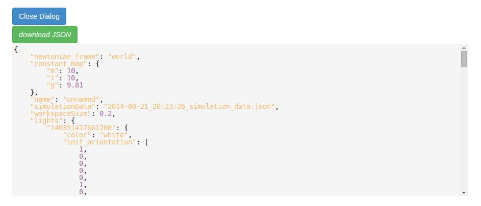

PyDy Visualizer
---------------

This document provides an overview of PyDy Visualizer. It enlists certain features
of the visualizer, and instructions to use the Visualizer.

PyDy Visualizer is a browser based GUI built to render the visualizations
generated by `pydy.viz`. It has many features to view and study the generated visualizations.

The visualizer can be embeded inside an IPython notebook. Inside the IPython notebooks, it also
provides additional functionality to modify the System parameters, from the GUI itself. The EoMs 
can be re-integrated using a click of a button from GUI, and can be viewed inside the same GUI in real time.

Here is a screenshot of the visualizer, when it is called from outside the notebook(from a terminal/interpreter):

.. image:: images/screenshot1.png
    :height: 400px
    :width:  600px

1. **Play Button**: Plays an animation. On Clicking play button, two buttons *appear*, "Pause" and "Stop", to pause and stop animation respectively.

2. **Show Model**: Shows the current JSON which is being rendered in visualizer. It can be copied from the text-box, as well as downloaded. On clicking `Show Model`, following dialog is created:

3. **Time Slider**: 
