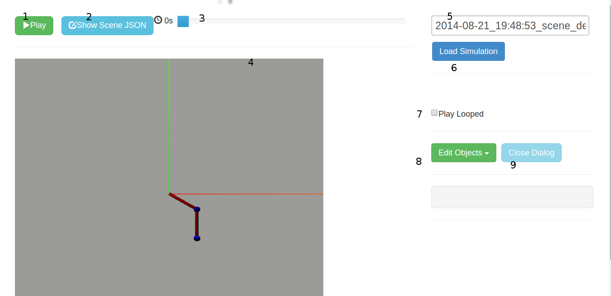

PyDy Visualizer
===============

The PyDy Visualizer is a browser based GUI built to render the visualizations
generated by ``pydy.viz``. This document provides an overview of PyDy
Visualizer. It describes the various features of the visualizer and provides
instructions to use it.

The visualizer can be embedded inside an IPython notebook or displayed
standalone in the browser. Inside the IPython notebook, it also provides
additional functionality to interactively modify the simulation parameters. The
EoMs can be re-integrated using a click of a button from GUI, and can be viewed
inside the same GUI in real time.

Here is a screenshot of the visualizer, when it is called from outside the
notebook, i.e. from the Python interpreter:

GUI Elements
------------

**(1) Play, Pause, and Stop Buttons**
   Allows you to start, pause, and stop the animation.
**(2) Play Looped**
   When checked the animation is run in a loop.
**(3) Time Slider**
   This is used to traverse to the particular frame in animation, by sliding
   the slider forward and backward. When the animation is running it will
   continue from the point where the slider is slid to.
**(4) Canvas**
   Where the animation is rendered. It supports mouse controls:

     - Mouse wheel to zoom in, zoom out.
     - Click and drag to rotate camera.

**(5) Show Model**
   Shows the current JSON which is being rendered in visualizer. It can be
   copied from the text-box, as well as downloaded. On clicking "Show Model",
   following dialog is created:

   .. image:: images/screenshot2.png
       :width:  650px

**(6) Edit Objects**
   On clicking this button, a dropdown opens up, showing the list of shapes
   which are rendered in the animation:

   .. image:: images/screenshot3.png
       :width:  300px

   On clicking any object from the dropdown, a dialog box opens up, containing
   the existing info on that object. The info can be edited. After editing
   click the "Apply" button for the changes to be reflected in the canvas (4).

   .. image:: images/screenshot4.png
       :width:  300px

**(7) Close Dialog**
   Closes/hides the "edit objects" dialog.

**Additional options in IPython notebooks:**

In IPython notebooks, apart from the features mentioned above, there is an
additional feature to edit simulation parameters, from the GUI itself. This is
how the Visualizer looks, when called from inside an IPython notebook:

.. image:: images/screenshot5.png
    :width:  600px

Here, one can add custom values in text-boxes(1, 2, 3 etc.) and on clicking
"Rerun" (4) the simulations are re-run in the background. On completing, the
scene corresponding to the new data is rendered on the Canvas.
