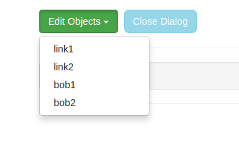
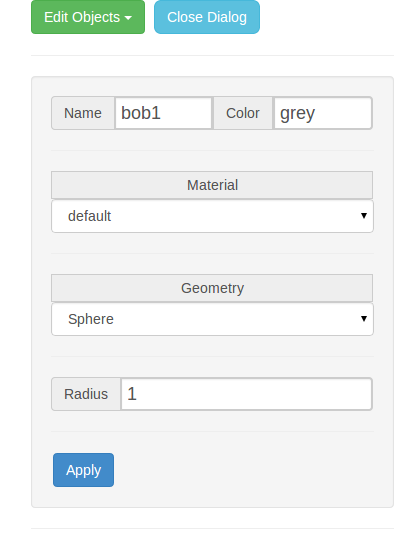
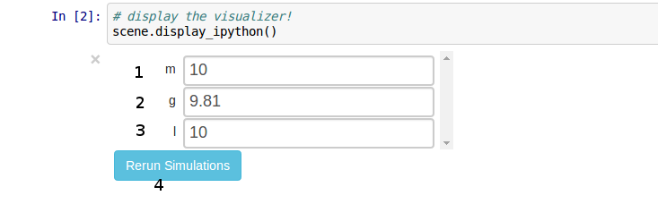

PyDy Visualizer
---------------

This document provides an overview of PyDy Visualizer. It enlists certain features
of the visualizer, and instructions to use the Visualizer.

PyDy Visualizer is a browser based GUI built to render the visualizations
generated by `pydy.viz`. It has many features to view and study the generated visualizations.

The visualizer can be embeded inside an IPython notebook. Inside the IPython notebooks, it also
provides additional functionality to modify the System parameters, from the GUI itself. The EoMs 
can be re-integrated using a click of a button from GUI, and can be viewed inside the same GUI in real time.

Here is a screenshot of the visualizer, when it is called from outside the notebook(from a terminal/interpreter):

.. image:: images/screenshot1.png
    :height: 400px
    :width:  600px

1. **Play Button**: Plays an animation. On Clicking play button, two buttons *appear*, "Pause" and "Stop", to pause and stop animation respectively.

2. **Show Model**: Shows the current JSON which is being rendered in visualizer. It can be copied from the text-box, as well as downloaded. On clicking `Show Model`, following dialog is created:

.. image:: images/screenshot2.png
    :height: 400px
    :width:  600px

3. **Time Slider**: It is used to traverse to the particular frame in animation, by sliding the slider forward and backward. In case the animation is running, it will continue from the point where the slider is "*slided to*".

4. **Canvas**: Where animation is drawn. It supports mouse controls:

  - Mouse wheel to zoom in, zoom out.
  - click and drag to rotate camera.

5. **Text Box**: Where the relative link to the scene file can be added. 

*Note*: The link should be relative to the dir. from where the server is run.

6. **Load Simulation**: Loads the scene from the file mentioned in the text-box above. The scene can also be preloaded, by specifying the file to be loaded in a GET Parameter: /index.html?load=/file/to/load.json

*Note*: In IPython notebook, the text box is automatically populated and scene file is loaded, on initialization, as well as when simulations are "re-run".

7. **Play Looped**: When checked, the animation is run in a loop.(folds back to time zero when it reaches the end.)

8. **Edit Objects**: On clicking this button, a dropdown opens up, showing the list of objects which are rendered in the animation:

On clicking any object from the dropdown, a dialog box opens up, containing the existing info on that object. The info can be edited. After editing, and click `Apply` button, the changing are reflected in the canvas(4).

9.  **Close Dialog**: Closes/hides the "edit objects" dialog.

**Additional options in IPython notebooks:**

In IPython notebooks, apart from the features mentioned above, there is an additional feature to edit simulation parameters, from the GUI itself. This is how the Visualizer looks, when called from inside an IPython notebook:

Here, we can add custom values in text-boxes(1,2, 3 etc.) and on clicking `Re-run simulation` button(4), the simulations are re-run in the background. On completing, the scene corresponding to the new data is rendered on the Canvas.

