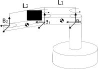

# Scara Robot - Kinetics and Dynamics Equations

Each folder contains a notebooks explaining the step-by-step to achieve the solutions for Kinetics and Dynamics equations.

## Requirements

* Sympy

## Summary

1. [Kinematics](#kinematics)

2. [Dynamics](#dynamics)

## Kinematics

Uses [Sympy](http://www.sympy.org/pt/index.html) to solve kinematics of **2 Degrees of Freedom Scara Arm**.

### Contents - Kinetics

* `Sympy`
  * Variables definition
  * Expression definitions
  * Analytic solutions

## Dynamics

There is a Notebooks explain how to develop movement equations from **2 Degrees of Freedom Scara**. The equations are solved using Lagrange's method from [Physics Module](http://docs.sympy.org/latest/modules/physics/index.html).

### Contents - Dynamics

* `Sympy`
  * Physics Module
    * Body definitions
    * Lagrange's Methods
