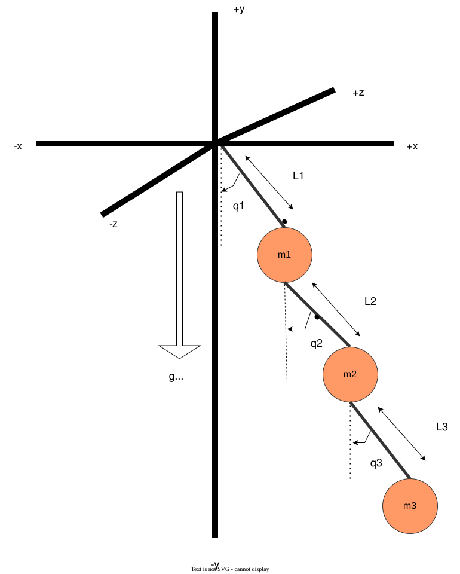

# Three-Link Conical Pendulum Example

This example shows how to derive, simulate, and visualize the motion of a three-link [conical pendulum](http://wikipedia.org).

<p align="center">
  
</p>

To run the complete example, execute `visualize.py` with the Python interpreter:

```bash
python visualize.py
```

Your default web browser should open with an interactive 3D visualization of the pendulum's motion.
