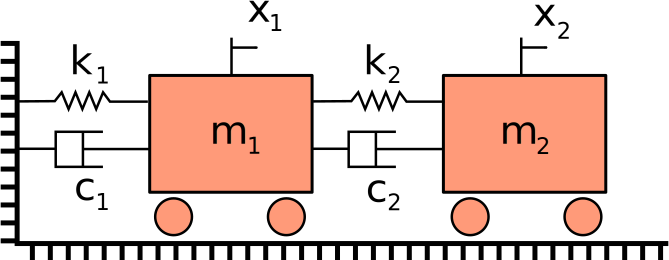

# Double Mass Spring Damper Example

## Dependencies

- sympy 1.0

## Problem

This code takes manually entered equations of motion and uses
pydy.system.System to simulate the time response. The diagram and defining
coordinates are given in the following figure.

<table class="image">
<tr><td> 
</td></tr>
</table>

The results of the simulation are displayed using the matplotlib library.
